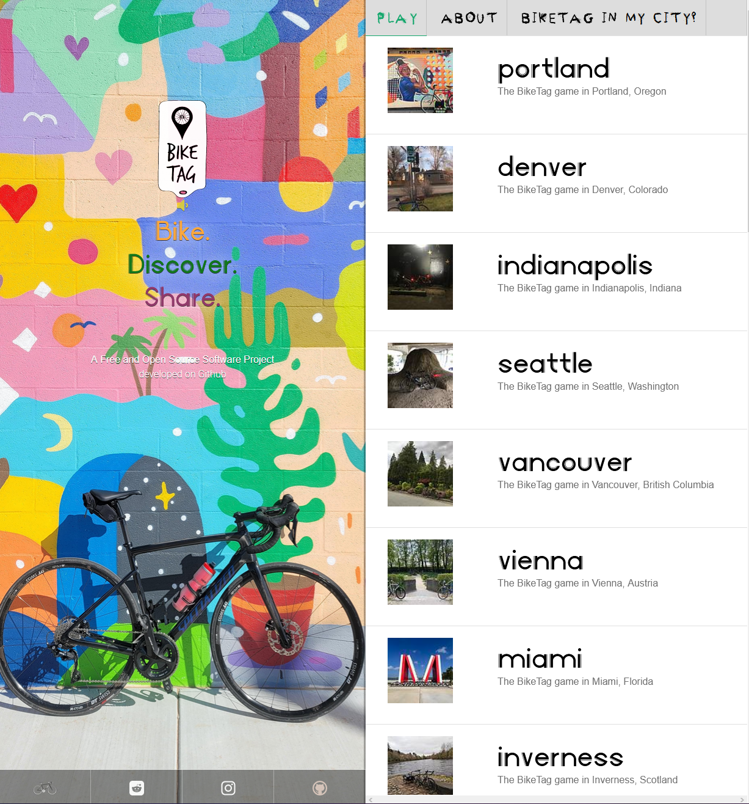
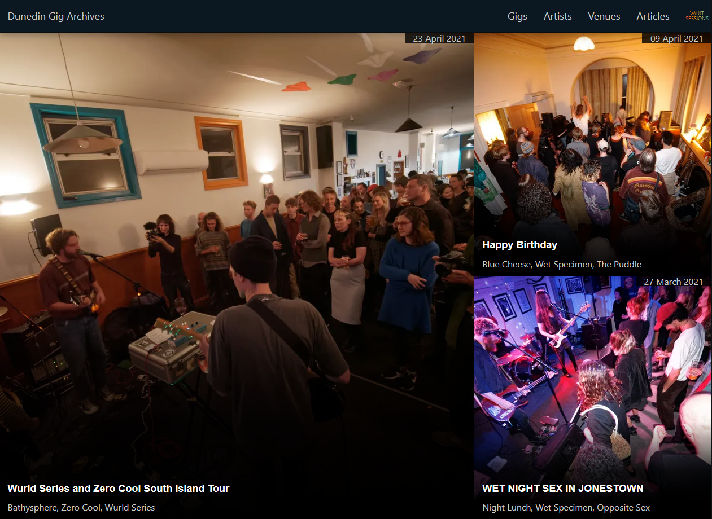
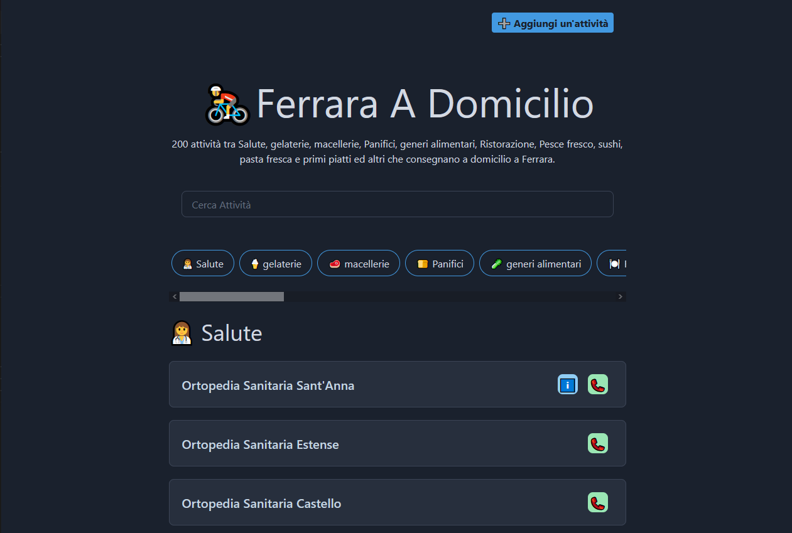
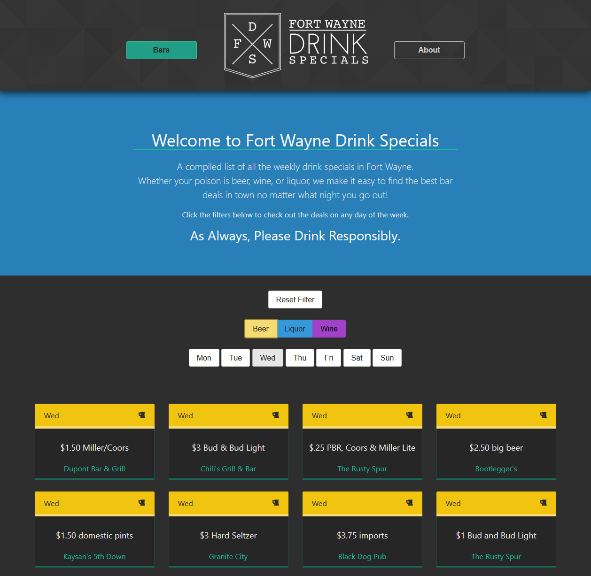
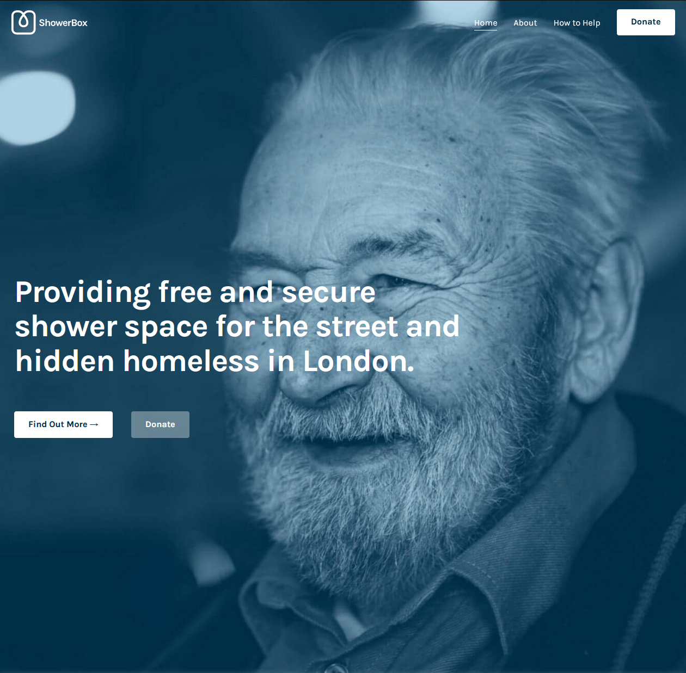
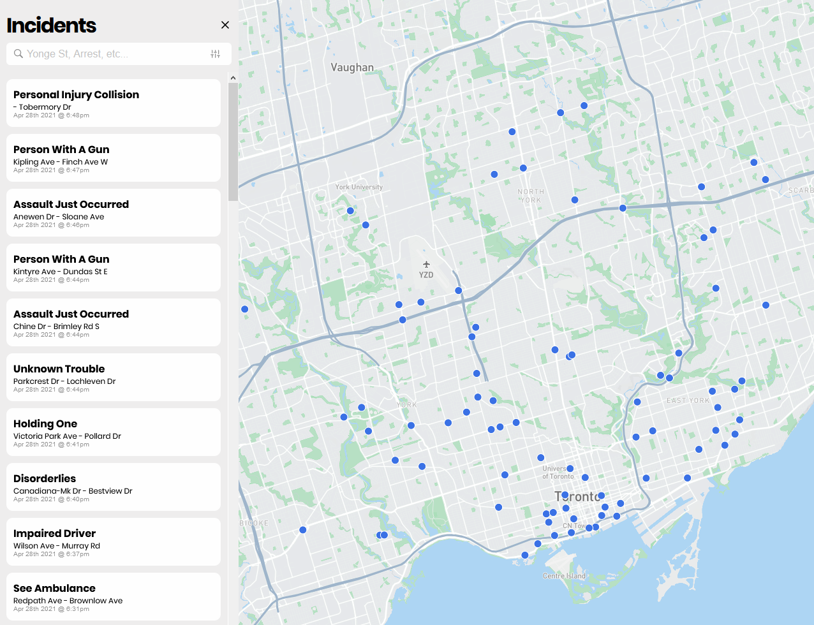

## The first Henry Gives Coffee post ended with: "Hopefully, it's a wild ride."

I really couldn't have guessed how much the idea behind this project would resonate with folks. A couple posts went viral on Reddit, there were people asking how they could donate and help out, and this first month had 60 submissions!

There were so so so many cool projects to look through. It's really amazing how many different things we can build with _mostly_ the same tools. I actually found some cool services that I'll be using outside of an HGC context.

Unfortunately I had to whittle it down to twenty projects in the [showcase](../../showcase) and the following six winners. While I loved everything y'all had to share with me, the line had to be drawn somewhere.

Please, though, read on to see why these six projects struck me as substantial contributions to the web and perfectly embody the thesis of "rad web shit for local communities".

---
---

## April's Most Rad ($25 each)

---
---

### [Bike Tag](https://biketag.org/) by [Ken Eucker](mailto:hello@biketag.org)

BikeTag is a mystery photo tag game played on bicycles in real cities all over the world. Pick your city, find where the latest tag is, and hop on your bike to go find it! This is a beautifully put together site is run by a team doing it for their shared love of biking. This one speaks to me on a personal level. <3

> Ken specifically wanted to plug that the BikeTag Team is an all-volunteer team of people who play the game of BikeTag in their city. Brought together by their love of Bike Fun, this group of volunteers maintain the BikeTag.bike and BikeTag.Org websites for all to enjoy.

---

### [Dunedin Sound](https://dunedinsound.com/) by [Fraser Thompson](mailto:fraser@dunedinsound.com)

Honestly, this one is my favorite. Fraser made this site specifically to document and archive his local music scene. Photos, videos, and bootleg(?) audio of ~250 shows in Dunedin, New Zealand. Rad as hell, dude. Having grown up with the music kids and gone to more shows than I can keep track of, this is a fantastic time capsule any scene would be lucky to have. And you can tell it's made with love. Speaking of music and GatsbyJS, I have a different side project I'll be reaching out about. ;)

---

### [Ferrara a Domicilio](https://ferraradomicilio.it/) by [Tommaso Poletti](https://tomma5o.com/)

Shops without a web presence around the world had trouble letting folks know they're still open in lockdown. Tommaso built this to help folks in his local community know which ones are open and delivering. This one is honestly beautiful in its simplicity. It does exactly what it needs to do and nothing more. Solid work.

---
---

## April's Honorable Mentions ($18 each)

---
---

### [Fort Wayne Drink Specials](https://fortwaynedrinkspecials.com/) by [Tony Gerardot](http://tonygerardot.com/)

Something like this should exist for every college town. It's a curated collection of all the drink specials at every restaurant in Fort Wayne for every day of the week. Great example of a college senior creating and maintaining something incredible for the public good.

---

### [ShowerBox](https://www.showerbox.org/) by [Andrew Smith](http://smithandsuch.com/)

This is one of my favorites of the bunch. Andrew created this slick web presence for a non-profit that helps the housing insecure population of London keep up with their personal hygiene and maintain their mental & physical wellbeing. Truly incredible work he's helping out with, and I hope they continue to do even greater good.

> Andrew specifically wanted to plug that they're looking for other non-profits to volunteer with. If you run one, or know someone who does, feel free to get in touch!

---
---

## April's Community Favorite ($15 each)

---
---

### [TPSCalls](https://www.tpscalls.live/) by [Riley Drnt](https://rileyyy.com/)

Transparency about police activity is more important than ever. TPSCalls is a real-time map of locations where the Toronto Police have responded to a call of service and what kind of incidents they're dealing with. And Riley is currently working on a v3! I love this kind of community 'looking out' and really hope more trackers like this start popping up.

---

I can't wait to launch this project for real and see all of the incredible things y'all are working on.

Hopefully, it's a wild ride.

Stay frosty.
