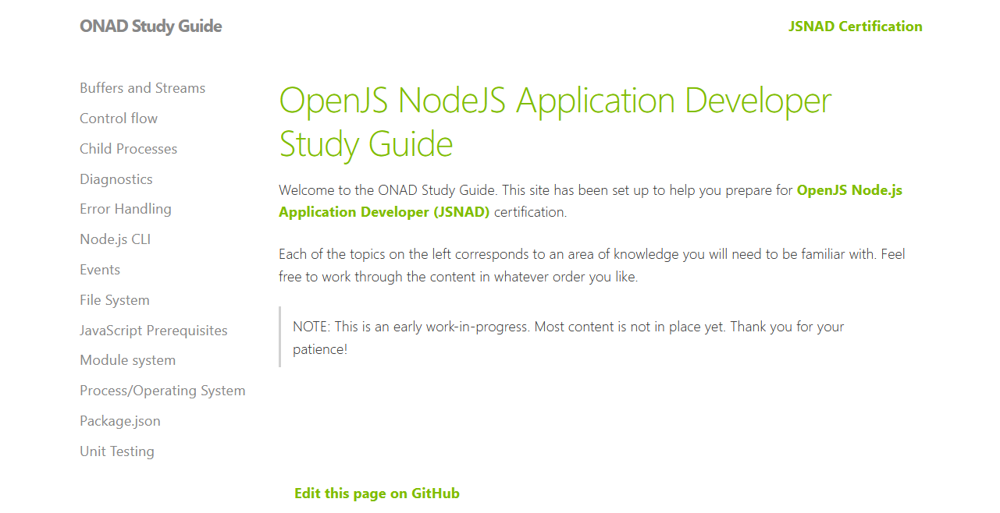
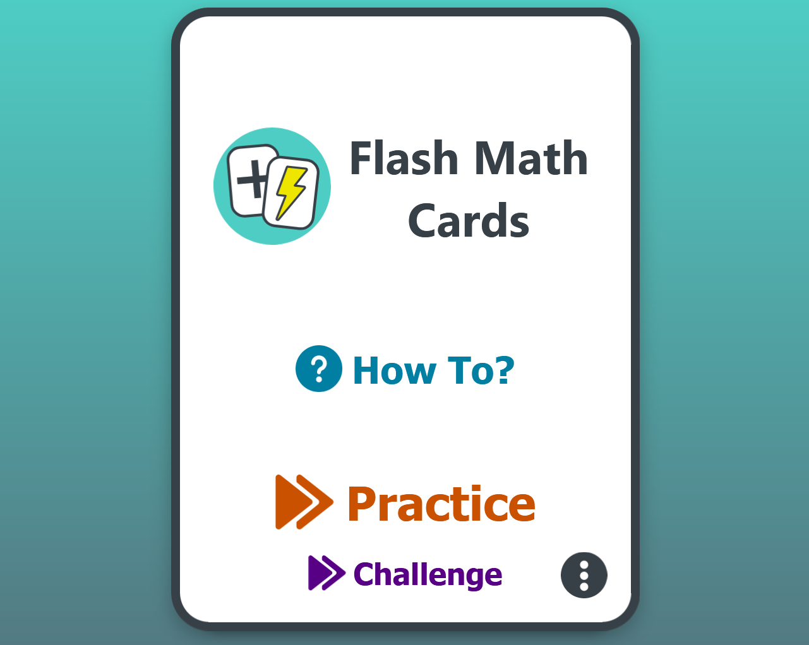
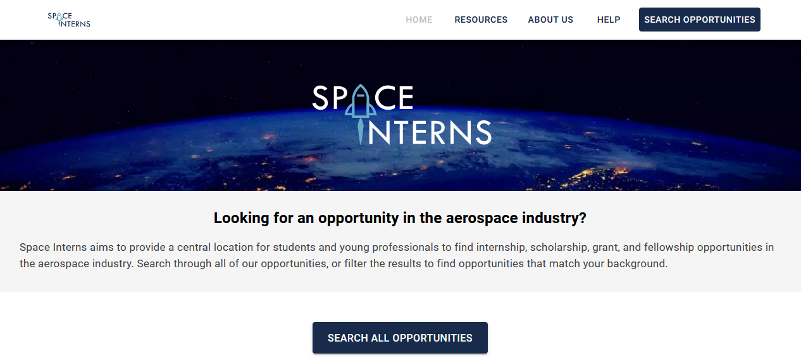
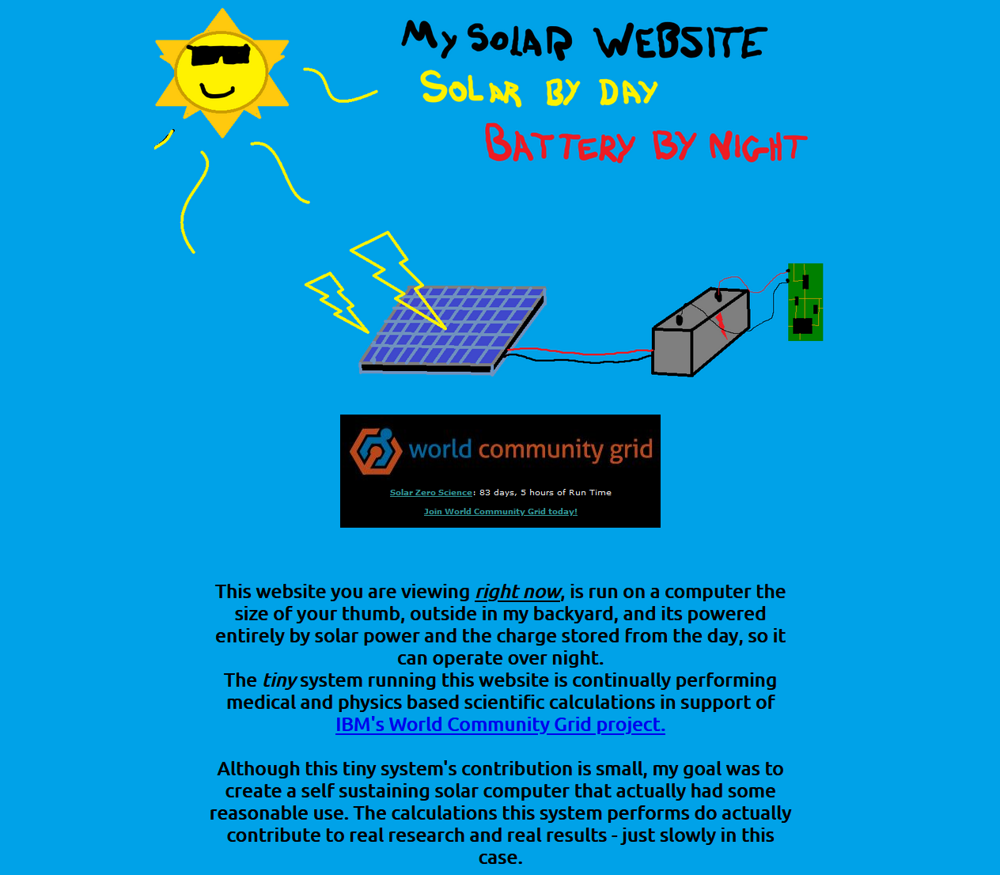

## The first Henry Gives Coffee post ended with: "Hopefully, it's a wild ride."

I really couldn't have guessed how much the idea behind this project would resonate with folks. A couple posts went viral on Reddit, there were people asking how they could donate and help out, and this first month had 60 submissions!

There were so so so many cool projects to look through. It's really amazing how many different things we can build with _mostly_ the same tools. I actually found some cool services that I'll be using outside of an HGC context.

Unfortunately, I had to whittle it down to twenty projects in the [showcase](../../showcase) and the following six winners. While I loved everything y'all had to share with me, the line had to be drawn somewhere.

Please, though, read on to see why these six projects struck me as substantial contributions to the web and perfectly embody the thesis of "rad web shit for local communities".

---
---

## April's Most Rad ($25 each)

Every month I pick three winners out of the submissions that meet all the criteria on the [rubric](../../rubric).

They'll be projects that really embody the theme of the month, open-source their code to help others build rad things, and just generally make the web a more interesting place. And for all that, they definitely deserve some coffee!

---
---

### [The Hyberobjects Gallery for Generative Art](https://hyperobjects.design/gallery) by [Erwin](https://twitter.com/hoogerwoord)

> BikeTag is a mystery photo tag game played on bicycles in real cities all over the world. Pick your city, find where the latest tag is, and hop on your bike to go find it! This is a beautifully put-together site is run by a team doing it for their shared love of biking. This one speaks to me on a personal level. <3

I was basically inseparable from my bike for several years, so the idea of an ongoing exploration-by-bike game is a REALLY cool idea to me. It's _kind of_ like a never-ending alleycat in a bunch of different places.

Bike communities are known for being pretty tight-knit and coming up with their own kind of fun (Type 2, or otherwise) and this is a great example.

A user by the name of "Thor" shared a game on a Minnesota bike community website where you take your picture of your bike near something notable and share it with the group. Then the first person to find and tag that location gets to set the next location for the group to find.

Simple right?

The game then seemed to jump to London, San Diego, Sydney, Vancouver, Inverness, Paris, Montreal, Islamabad, Washington D.C., Chicago, Miami, the video game "Grand Theft Auto", and a solid handful of other cities.

It eventually found Ken (and his buddy Evan) and they figured they needed a way to make it more accessible for folks, and [BikeTag.org](https://biketag.org) is what came out of their effort.

Without making an actual mobile application, Ken replicated the experience of one in a browser so that there are as few barriers to entry as possible. You just scroll down to select your city and immediately see the location of the current round, so you can hop right in the saddle and get moving.

When you find the spot, take a picture, and figure your next location out, hitting "Play" brings you to a form to quickly upload your pictures and your handle to bump your city to the next round.

For real, this whole thing is streamlined to help keep cyclists doing what they love, cycling around and exploring the cities they're in. They even set up a Slack group so that folks can keep in touch with other players in their region or around the globe.

And the whole thing is [open-sourced](https://github.com/keneucker/biketag-website) with a managed developer API so that anyone can hack on and expand what Ken and his team have built. That's rad AF.

This is a great example of a "labor of love" for a specific community I was picturing when I put out the call for projects for last month.

Excellent job, Ken. I'm happy to throw you some coffee money and see how this project grows. Also going to share this with my local bike community in New Haven and see if they want to set something up. There's always PLENTY to explore around Yale.

> Ken specifically wanted to plug that the BikeTag Team is an all-volunteer team of people who play the game of BikeTag in their city. Brought together by their love of Bike Fun, this group of volunteers maintain the BikeTag.bike and BikeTag.Org websites for all to enjoy.

---

### [Lingraphic](https://lingraphic.app/) by [Will Fry](https://willfry.co.uk/)

> Honestly, this one is my favorite. Fraser made this site specifically to document and archive his local music scene. Photos, videos, and bootleg(?) audio of ~250 shows in Dunedin, New Zealand. Rad as hell, dude. Having grown up with the music kids and gone to more shows than I can keep track of, this is a fantastic time capsule any scene would be lucky to have. And you can tell it's made with love. Speaking of music and GatsbyJS, I have a different side project I'll be reaching out about. ;)

Like I said, I shouldn't be picking favorites... but this one's my favorite. Fraser found that their local music scene was having a problem similar to what a lot of others have: there are a LOT of local bands with incredible gigs in smaller venues that go unrecorded.

There's often live music all around us that we don't know about. We may not know the venues or have time to go to all the shows, but the energy from those experiences deserves to live on.

Even though I was never super musical myself, I grew up in circles of music kids. I was friends with a lot of bands and saw a LOT of shows around central CT and Burlington, VT. It's important to preserve what comes out of your scene. Some bands will break out and "make it" but plenty stay small and local, and that's rad too.

But I can't explain how much I'd love to check out old sets from Exit Ghost or Eye Of The Pyramid at Brookside Nights.

Fraser built something incredible that tracks 250+ shows across his area of Dunedin NZ. With breakdowns by gig, artist, and venue locals can find just about any set they can think of. And once you dive down, you can find video and downloadable bootleg audio of almost every set.

There's also a blog keeping track of local music news, what's going on with the pandemic, interviews with musicians, and a whole lot more.

Anyone reading this who's in a band or frequents these smaller shows understands how gd rad this is. Oftentimes, these smaller local bands really get friendly with each other and run in the same circles. It really is incredible that there's this one resource keeping track of it all so that folks can look back and relive all these memories in like ten years.

You've built something really rad here, Fraser. I'm really glad to send you some coffee money so that you can keep this project moving forward. You're doing a good thing, soaking up the good vibes from all those shows and putting that love back out in the world.

Keep killing it.

---

### [ONAD Study Guide](https://nodestudyguide.com/) by [Donovan](https://hop.ie/)

> Shops without a web presence around the world had trouble letting folks know they're still open in lockdown. Tommaso built this to help folks in his local community know which ones are open and delivering. This one is honestly beautiful in its simplicity. It does exactly what it needs to do and nothing more. Solid work.

I'm sure we can ALL relate to what Tommaso experienced.

The pandemic happened and suddenly a lot of us are ordering food, clothes, and other supplies from our favorite local shops. We'll just hop on some app or website and order our...

Wait, my local independent grocer doesn't have a web presence?

A lot of shops all over the world don't have a website. A lot of shops all over the world aren't covered by Postmates (or something similar).

Plenty of mom-and-pop shops don't have the time, experience, or resources to set up and maintain a website. And the pandemic meant a LOT less foot traffic was making its way through their doors.

Tommaso saw this and built Ferrara A Domicilio to help address that need in their local community.

It's a one-page site, beautiful in its simplicity, that keeps track of 200-ish different ice cream parlors, bakeries, butchers, and so much more with multiple methods of contact.

In a time when it's not always safe to bike across town to see if your favorite not-online sushi place is still open, this is a great way to keep track of small shops. Just filter by sushi, find your preferred restaurant, and give them a call to see if they're open.

What's even better, this is an offline-ready PWA, so anyone who wants to save this to their phone will have the entire list saved locally in case they ever need to look a shop up without access to the internet.

Tommaso went a step further and open-sourced the [boilerplate code](https://github.com/tomma5o/domicilioBoilerplate) so that anyone can quickly spin up a version for their town, with instructions on how to set it up and quickly host it with Netlify.

It's so rad that they were able to see a problem and not only solve it for their community but build out a template for other people to quickly expand it out and help even more people.

You love to see it. Really glad to send you some coffee money, Tommaso. I hope you have a great espresso pull for me. ;)

---
---

## April's Honorable Mentions ($18 each)

Every month I pick two winners out of the submissions that _don't quite_ meet all the criteria on the [rubric](../../rubric).

They'll often be projects that are just as rad as the winners but maybe don't open source their code. They still make the web more interesting and totally deserve some coffee for their efforts!

---
---

### [Flash Math Cards](https://flashmath.cards/) by [Kyle Simpson](mailto:getify@gmail.com)

> Something like this should exist for every college town. It's a curated collection of all the drink specials at every restaurant in Fort Wayne for every day of the week. A great example of a college senior creating and maintaining something incredible for the public good.

The premise here is pretty simple. When Tony was a college senior he and his buddies were keeping track of local drink specials in a notebook that they would consult before going out for the night.

This is basically that notebook wrapped up with a slick web interface. Honestly one of the more slick LAMP + Bootstrap projects I've ever seen.

If you're ever in Fort Wayne, this lets you filter by type of alcohol you want to drink (beer/liquor/wine) and the day of the week to see the best local drink specials.

And the whole thing is crowdsourced - if you happen to find anything missing, just let them know via the contact form at the bottom of every page and it'll get added to the collection.

Just like the previous winner, this is honestly incredible in its simplicity.

It does one thing and it does it well.

I would have loved something like this for my college years in Vermont. My buddies and I would hit up whatever bar we wanted to head to, and select from the drink specials there. But some nights, when money is tight or you really need a couple drinks, something like this would have been a great resource.

While this doesn't strictly serve a "community" in the way I was expecting, it's a solid piece of public good for the drinking population of Fort Wayne.

Glad to send you some drink money, Tony. Glad to know you already have a tool to spend it economically!

---

### [Space Interns](https://spaceinterns.org/) by [Christopher Fu](https://twitter.com/cfu288)

> This is one of my favorites of the bunch. Andrew created this slick web presence for a non-profit that helps the housing insecure population of London keep up with their personal hygiene and maintain their mental & physical wellbeing. Truly incredible work he's helping out with, and I hope they continue to do even greater good.

Honestly, this is my second favorite of the bunch. It's a slick-looking website that does a lot to help a solid non-profit.

ShowerBox is creating free and secure shower spaces for the street and hidden homeless in London.

They're helping stop the spread of disease, allowing folks to maintain their personal hygiene, and aiding people to improve their mental and physical health.

When they got their first shower trailer on the streets of London, they were able to provide showers to people who haven't had the opportunity to bathe in months. They've since expanded to working with churches, are working on creating a fixed solar-powered shower facility, and have plenty more in the works.

Before Andrew's work, ShowerBox was operating on a simple WordPress page. This is an incredibly striking bit of re-branding that I really hope helps pull in more donors (of money, time, and toiletries) so that they can help more folks in London and beyond.

I love what you were able to do for ShowerBox, Andrew. I'm glad to be able to send you some money for coffee, and I'm giving a separate donation over to the non-profit. As of this writing, they're just $1,453 short of their current [crowdfunding goal](https://www.justgiving.com/crowdfunding/showerbox).

> Andrew specifically wanted to plug that they're looking for other non-profits to volunteer with. If you run one (or know someone who does) feel free to get in touch!

---
---

## April's Community Favorite ($15 each)

Every month, a group of [my Patreon](https://www.patreon.com/henrygivescoffee) patrons selects their favorite project (that aren't already winners or honorable mentions) to get half of their total donations.

I present them with a list of the other awesome projects and they vote on who receives this award. My patrons have spoken and decided that this developer DEFINITELY deserves some coffee.

---
---

### [Science By Solar](https://sciencebysolar.me/) by Jamie

> Transparency about police activity is more important than ever. TPSCalls is a real-time map of locations where the Toronto Police have responded to a call of service and what kind of incidents they're dealing with. And Riley is currently working on a v3! I love this kind of community 'looking out' and really hope more trackers like this start popping up.

We (at least in my home country) need police transparency more than ever.

Riley built this incredible real-time map of locations the Toronto Police have responded to incidents. It covers arrests, gun calls, assaults, disputes, and so much more.

They're pulling directly from a data feed from the Toronto Police and putting most of it (domestic violence, sexual assault, and medical distress incidents are filtered out) in this more easily digestible format.

Whether someone is looking to move to Toronto and want an idea of what the danger profile in a particular neighborhood might look like, or just want to have a better idea of what actual police activity looks like versus what's presented in the news, this is an incredible resource to keep an extra eye on the folks who are supposed to keep us safe.

It also just helps people in the community feel safer. If there's a loud bang a few streets over, it's helpful to have a place like this to check (from the safety of your own home) if the police are addressing the problem.

This is a really cool thing you've built, Riley. It's always interesting to see data visualization projects that help people digest data that can be tricky to source or make sense of. I truly hope more of these start popping up around the world.

Glad to send you some coffee money and can't wait to see what you build next!

---
---

It was an absolute pleasure checking out all the amazing projects so many of you submitted. You really built some incredible experiences, corners of the web, and helpful tools to help all sorts of people in different aspects of their lives.

I'm sending out digital payments to all six winners right after this post goes live. If you're one of those developers and don't receive a payment by the end of the day (May 01, 2021), please reach out and I'll get you hooked up.

Thank you all for building rad shit for the web. The world needs it and plenty of folks are benefitting from the projects you're maintaining.

Next month's theme is "Education". If anyone reading this (or anyone you know) is working on a project that allows people to learn something, please head over to the [Submit a Project](../../submit) page and let me know about it!

It might just be you I'm giving coffee to next month.

Until then, stay frosty.

---
---
