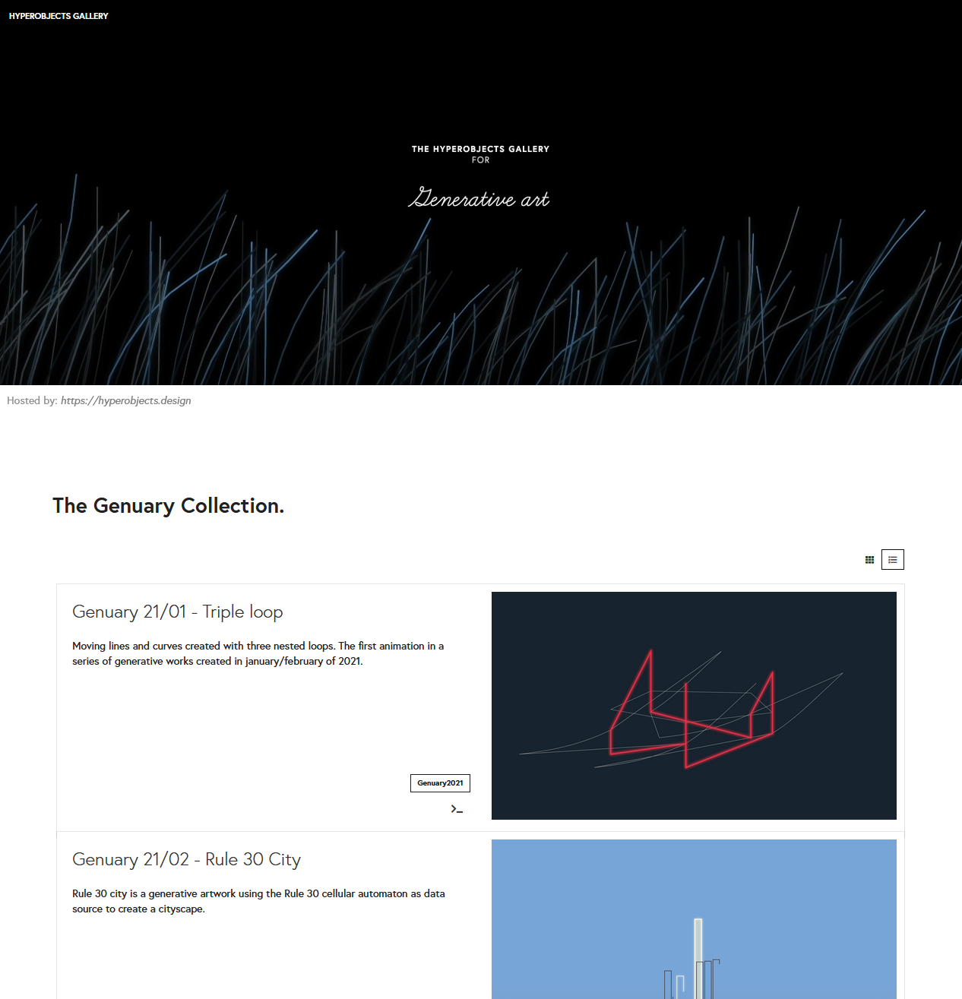
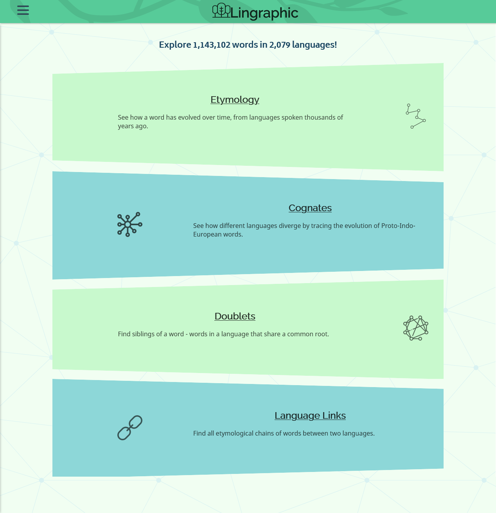

## The first Henry Gives Coffee post ended with: "Hopefully, it's a wild ride."

This project continues to amaze. I thought it would just be a fun little thing I ran for a couple of months to see how it went but the submissions kept rolling on in. A little less than last month (without all the viral Reddit hype) but I'm so glad that the idea of rad web shit is resonating with so many folks.

It was so much fun looking through all the new projects. It still blows me away how people, when given access to some web tools, have a tendency to build things that can benefit others. This month of "Education" project didn't disappoint in that regard.

I whittled the list of projects down to eight in the [showcase](../../showcase) and the following six winners. Some submissions didn't match the theme and others didn't have their projects live on the web. While I loved everything y'all had to share with me, the line had to be drawn somewhere.

Please, though, read on to see why these six projects struck me as substantial contributions to the web and perfectly embody the thesis of "rad web shit for education".

---
---

## May's Most Rad ($25 each)

Every month I pick three winners out of the submissions that meet all the criteria on the [rubric](../../rubric).

They'll be projects that really embody the theme of the month, open-source their code to help others build rad things, and just generally make the web a more interesting place. And for all that, they definitely deserve some coffee!

---
---

### [The Hyberobjects Gallery for Generative Art](https://hyperobjects.design/gallery) by [Erwin](https://twitter.com/hoogerwoord)

> Erwin built a gallery for generative artworks that shows the finished work and shares the source code to help other artists learn how to create their own pieces. With the built-in workbench, the code can run live in the browser to help you learn quickly.

Generative art has always seemed like a really cool concept to me. Taking a relatively small amount of code and having it create a fun graphic (let alone one that moves) just seems wild. And honestly, it's been something I've been wanting to get into for a while.

Having this come through as a submission is a great bit of serendipity.

Erwin put together this incredible gallery of differing examples of generative art, but went a step further and included the source code for everything. And then went ANOTHER step further and included a workbench that lets you fiddle with the code and run it live in your browser.

I was hoping to see some web projects that showcase developers sharing something they're passionate about in a way that really helps other people deeply understand something new. This 100% fits the bill.

Couldn't think of a better example of the kind of ethos this website is based on. Kudos, Erwin. I truly hope you keep building rad web shit for a long time coming.

---

### [Lingraphic](https://lingraphic.app/) by [Will Fry](https://willfry.co.uk/)

> Will built Lingraphic on top of their own linguistics parser to help people learn etymology through graphic visualizations and easy to understand network graphs. This is a goldmine for anyone interested in learning about the evolution of human language.

I've never been much of a linguistics nerd but this definitely makes it a lot of fun to dig into how certain words have come to be. I plugged in the [English word "coffee"](https://lingraphic.app/etymology/en/coffee) and found out that it traces back to the Dutch word "koffie" and even further back to the Ottoman Turkish word "kahve".

Lingraphic takes what can be complicated topics like etymology, doublets, and sound laws and clears things up with very clear network diagrams.

Designed as a tool for amateur linguists and people just interested in languages, Will put together a very polished web app that parses a lot of data from Wiktionary and makes it super accessible.

This is an incredible example of creating a space on the web to help others learn about something you're passionate about and pretty much exactly the type of thing I was hoping to see this month.

Keep building rad things, Will!

> Wanted to Plug: Will wanted his micro-scholarship to go to a charity that helps with tech education. Code.org® is a nonprofit dedicated to expanding access to computer science in schools and is linked below under 'Donate'.

---

### [ONAD Study Guide](https://nodestudyguide.com/) by [Donovan](https://hop.ie/)

> Donovan and some of their friends are getting ready to take the OpenJS Node Developer Certification exam and are putting this tutorial site together to both help themselves and others prepare for the exam. This is a fantastic example of learning in public. Way to pay it forward!"

Learning in public (writing the blog post you wish you could find when trying to learn something) is a fantastic way to make sure information sticks with you. To write the post you need to understand the topic in order to explain it to someone who knows less than you.

Donovan and their friends are working on this study guide for the OpenJS Node Developer Cert exam and are going through everything topic by topic. As they learn the material, they add another page to their study guide (both for them to reference back to and to help others study in the future).

Honestly, I've been meaning to dig into what's going on with Node "behind the curtain" and having this land in my inbox was a fun little surprise.

Consider me one more person keeping up with what y'all are working on. Can't wait to dig into what you write up about Diagnostics!

> Wanted to Plug: Donovan also blogs about CSS animation on the website https://CSSAnimation.rocks!

---
---

## May's Honorable Mentions ($18 each)

Every month I pick two winners out of the submissions that _don't quite_ meet all the criteria on the [rubric](../../rubric).

They'll often be projects that are just as rad as the winners but maybe don't open source their code. They still make the web more interesting and totally deserve some coffee for their efforts!

---
---

### [Flash Math Cards](https://flashmath.cards/) by [Kyle Simpson](mailto:getify@gmail.com)

> Kyle built this website to help kids practice their math skills with interactive flash cards. With options for different kinds of problems and three difficulties, this can also be installed as a progressive web app on a smartphone for flash cards on the go.

Flash cards are a great way to learn math. Doubly so for kids. And interactive ones are just better.

This site lets you choose between addition, subtraciton, multiplication, and division. And then gives you difficulties to choose from.

There are flash cards that you just need to figure out the answer before you manually flip them over and cards that give you a short timer to type out the answer.

If you have someone in your life that needs help brushing up on some basic math skills, this is a great way to do it. And Kyle even built it was a Progressive Web App (PWA) so that people can "install" it on their phone to use it even without internet access.

This is a pretty rad web project for education. And there are always bonus points for PWA's, Kyle. Good job!

> Wanted to Plug: Open web technology is always superior to closed/proprietary native code! PWAs FTW!

---

### [Space Interns](https://spaceinterns.org/) by [Christopher Fu](https://twitter.com/cfu288)

> Christopher (and their friend Caroline) built the only dedicated platform for recurring space internship and fellowship programs, scholarships, and grants. They hope Space Interns increases the diversity of the future space workforce and I hope they're right. Space exploration is near and dear to me, and this project is incredible.

Just like it says on the tin. Space Interns is a site that aggregates all the recurring space internship, fellowship programs, scholarships, and grants that the creators can find.

Seeing a rocket launch from Cape Canaveral when I was very young is what put me on a path towards a STEM education. The idea of someday being part of the space industry helped get me into tech and set me up to even have this Henry Gives Coffee project.

It's rad as hell that Caroline and Christopher put this together to make it easier for students to find a pathway into the space workforce. Finding a pathway from high school to a career you might want to have is never easy. I'm sure this will be an invaluable resource to many teens and college students looking to map out a trajectory to helping us better explore and understand the universe.

A+ team. Keep doing what you're doing. Through all the scientific advancement that comes from space _things_, you're seriously helping make the world a better place.

---
---

## May's Community Favorite ($15 each)

Every month, a group of [my Patreon](https://www.patreon.com/henrygivescoffee) patrons selects their favorite project (that aren't already winners or honorable mentions) to get half of their total donations.

I present them with a list of the other awesome projects and they vote on who receives this award. My patrons have spoken and decided that this developer DEFINITELY deserves some coffee.

---
---

### [Science By Solar](https://sciencebysolar.me/) by Jamie

> Jamie built a solar powered computer that performs medical and physics based calculation for IBM's World Community Grid Project. It makes meaningful contributions to science without taking anything in exchange. This website even gives some information on how to build a solar powered computer of your own!

This one is just a lot of fun. It's a little website run on a Raspberry Pi Zero, powered from a little solar panel, that does medical and physics calculations to help out IBM's World Community Grid Project.

The ["More Nerd Stuff"](https://sciencebysolar.me/nerds.html) page talks more about how the panel, battery, and computer are hooked up and running in a little enclosure outside of Jamie's house. It's a short explanation with some pictures about how the system is set up to run those calculations for the Berkeley Open Infrastructure for Network Computing (BOINC).

Science by Solar isn't an education site in the same vein as the other sites on this list, but it's fun all the same. It does something neat, teaches others about some of the tech behind it, and helps show what's possible with computers running on renewable energy sources!

Incredible job Jamie. Keep the scrappy hacking up!

> Wanted to Plug: Please be gentle, she might crash!

---
---

Again, it was an absolute joy to check out all of the incredible things y'all built and submitted. It's always really fun to see what's going on in the non-corporatey parts of the web.

First thing tomorrow morning I'm sending out digital payments to the winners who provided a payment link and forwarding the awards for those who didn't to the folks over at [Code.org](https://code.org). If you're one of those developers and don't receive a payment by the end of the day (June 03, 2021), please reach out and I'll get you sorted.

Thank you all for building rad shit for the web. The world needs it and plenty of folks are benefitting from the projects you're maintaining.

Next month's theme is "Sharing a Hobby". If anyone reading this (or anyone you know) is working on a project that shares information about something you're passionate about, please head over to the [Submit a Project](../../submission) page and let me know about it!

It might just be you I'm giving coffee to next month.

Until then, stay frosty.

---
---
